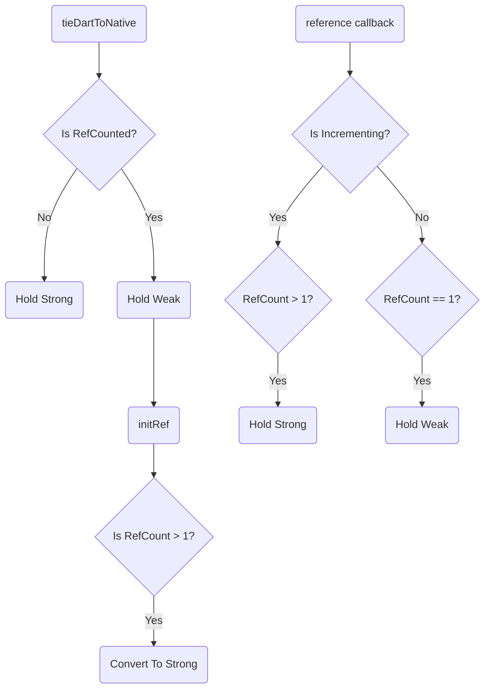

# Memory

`RefCounted` objects in Godot need special handling in garbage collected languages like Dart. 

Any `RefCounted` object that is refernced by Dart adds one to its reference count, and its Script Instance Binding or Extension Instance Binding holds a handle to the Dart version of the object. However, Dart needs to know if it can safely garbage collect this object and release its reference to the `RefCounted` object, otherwise Dart will hold it forever and the object will leak.

What Dart does is use the `referenced` callback of both Script Instance Bindings and Extension Instance Bindings to determine if it is the *only* reference to a `RefCounted`object.  If it is, the Godot Dart engine converts its reference to the object to *weak*, which means that if no objects in Dart are referencing it, it can safely be garbage collected.  If Dart is not the only reference, the Godot Dart engine changes its reference to *strong* so that even if no Dart objects are referencing the object, Dart doesn't accidentlly garbage collect a handle it needs to remain valid.

To help make sense of the logic, here's a diagram:

